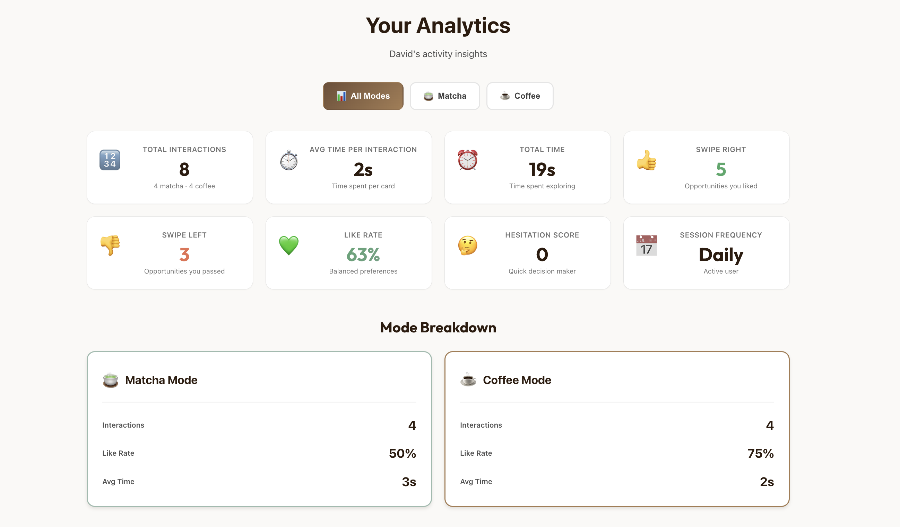
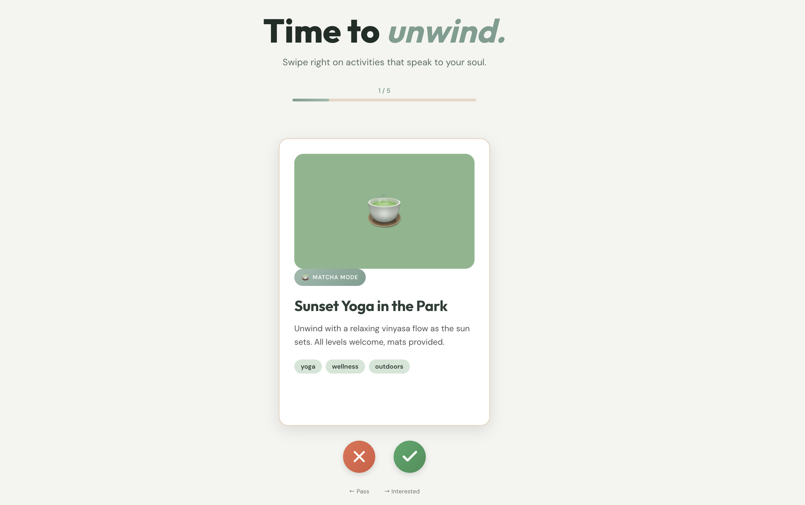
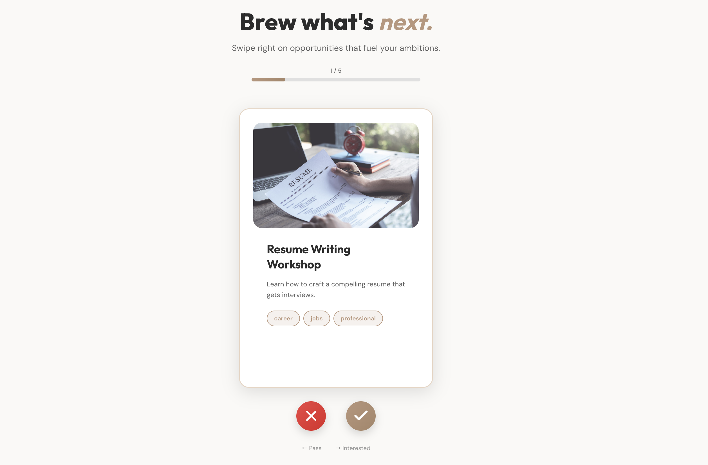

# ☕ CommonGrounds

**CommonGrounds** is a swipe-based platform that helps students discover opportunities that reflect who they are and who they’re becoming.

In a world hyper-focused on internships and networking, it’s easy to get stuck in the same loops. CommonGrounds encourages exploration beyond the mundane by letting identity form through interaction, not pressure.

## App Design






---
## 🔨 How to Run
Download this repo, open the CommonGrounds folders then do the following in the terminal.
```bash
# download requirements and start backend server
# begin at root
cd api
python -m venv venv
venv\Scripts\Activate  # Mac/Linux: source venv/bin/activate
pip install -r requirements.txt
uvicorn main:app --reload

# start frontend
# begin at root
cd frontend
npm install
npm run dev
```

## 🌱 Identity in Action

CommonGrounds treats identity as something dynamic. Instead of forcing users to define themselves upfront, the platform learns from how they explore, swipe, and engage.

### 🍵 Personalize Your Blend

Users can post and discover both **personal experiences** and **professional projects**, swiping to like or skip based on interest.

* **Matcha Mode**: hobbies, passions, and personal growth
* **Coffee Mode**: career interests and peer-driven professional projects

This separation allows users to explore different sides of their identity without mixing signals.

### 🤖 AI Personalization

CommonGrounds adapts recommendations over time using user behavior.

* User profiles + event descriptions are embedded using **all-MiniLM-L6-v2**
* Swipes and time spent continuously update user embeddings
* Cosine similarity enables fast, relevant recommendations
* **Gemini 2.5 Flash-Lite** provides insights and natural-language summaries

Together, this creates a feedback loop where exploration shapes identity and identity shapes recommendations.

### Reflective Dashboard

Users can view stats about their activity and receive AI-generated insights suggesting new experiences to explore or ways to balance personal and professional growth.

---

## 🛠️ Tech Stack

* **Frontend**: Next.js
* **Backend & DB**: Supabase + FastAPI
* **AI / ML**:
  * Gemini 2.5 Flash-Lite
  * all-MiniLM-L6-v2 (Sentence Transformers)

---

## What’s Brewing Next

* Deeper analytics with tools like Amplitude
* Location-based discovery
* In-app chat for collaborators

