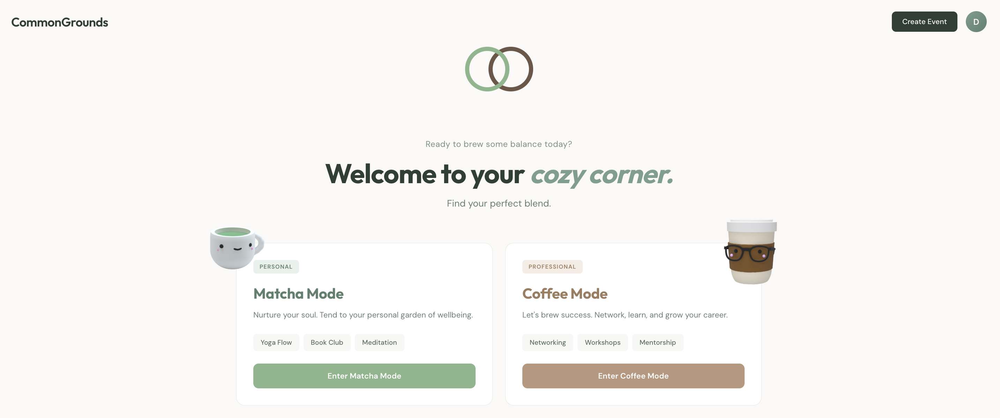
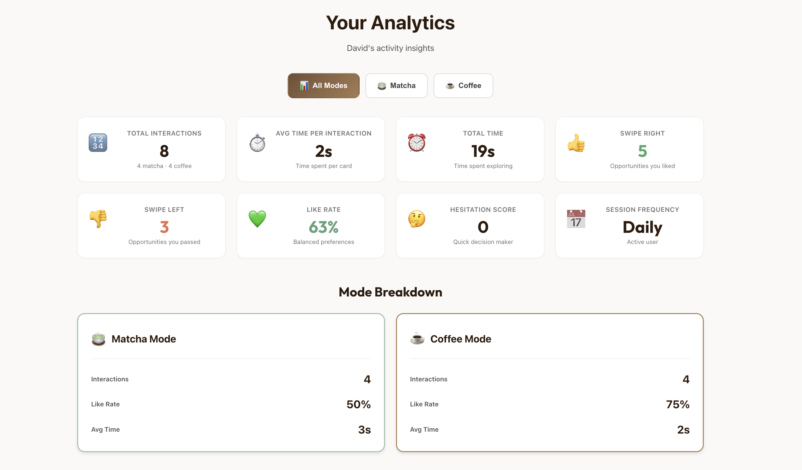
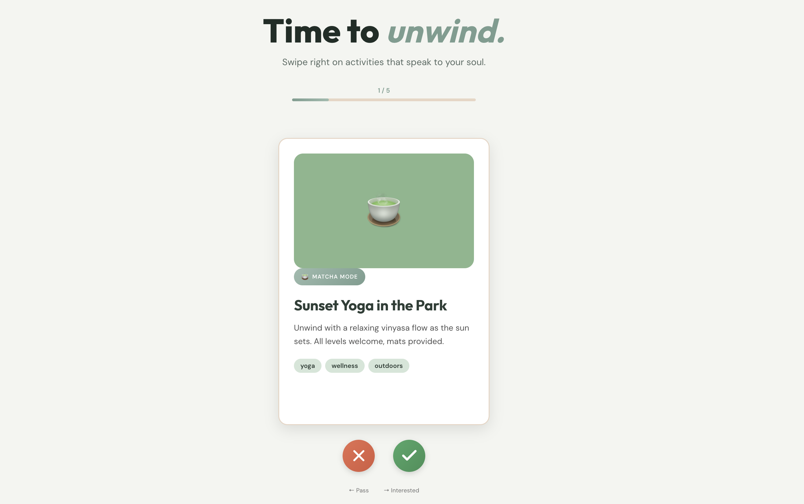
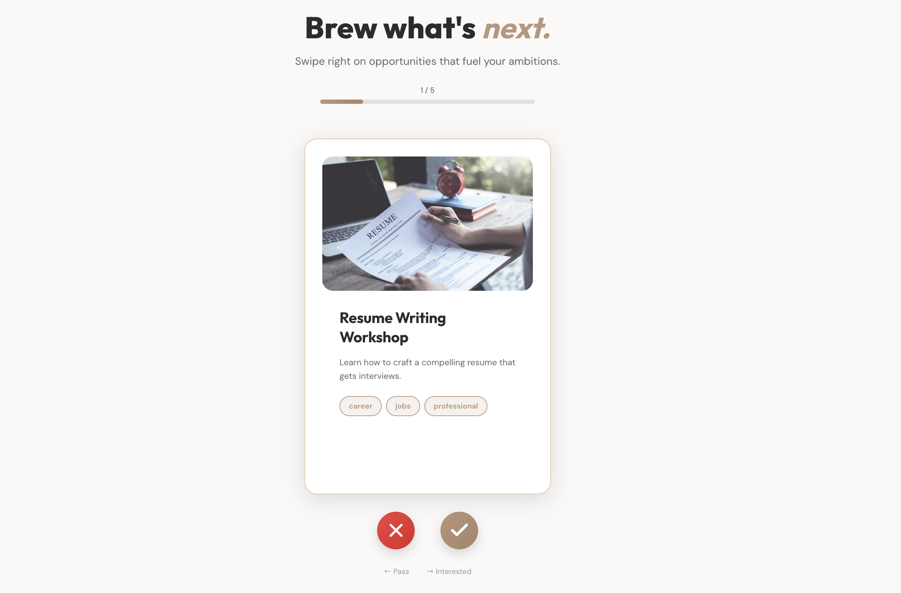
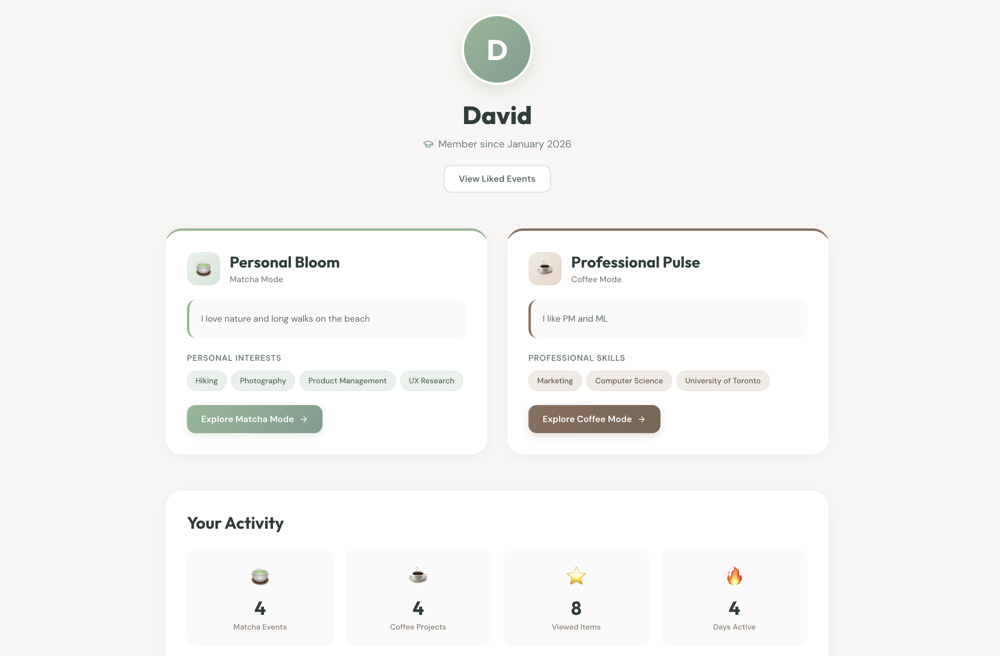

# ☕ CommonGrounds

**CommonGrounds** is a swipe-based platform that helps students discover opportunities that reflect who they are and who they’re becoming.

In a world hyper-focused on internships and networking, it’s easy to get stuck in the same loops. CommonGrounds encourages exploration beyond the mundane by letting identity form through interaction, not pressure.

## App Design






---
## 🔨 How to Run
Download this repo, open the CommonGrounds folders then do the following in the terminal.
```bash
# download requirements and start backend server
# begin at root
cd api
python -m venv venv
venv\Scripts\Activate  # Mac/Linux: source venv/bin/activate
pip install -r requirements.txt
uvicorn main:app --reload

# start frontend
# begin at root
cd frontend
npm install
npm run dev
```

## Recommendation Benchmarking

The `/events` recommendation endpoint now emits benchmark headers:

* `X-CG-Cache-Events` and `X-CG-Cache-Recommendations`
* `X-CG-Timing-User-Db-Ms`, `X-CG-Timing-Events-Db-Ms`, `X-CG-Timing-Analytics-Db-Ms`
* `X-CG-Timing-Recommend-Ms`, `X-CG-Timing-Total-Ms`
* `X-CG-Count-Events` and `X-CG-Count-Results`

Start FastAPI before running a local benchmark:

```bash
cd api
uvicorn main:app --reload
```

In a second terminal, run the warm-cache benchmark. This preserves the current behavior: the
script warms the endpoint first, then measures sequential cached requests.

```bash
cd api
python benchmark_recommendations.py \
  --base-url http://127.0.0.1:8000 \
  --user-id 1 \
  --matcha-mode \
  --scenario warm \
  --limit 5 \
  --iterations 25 \
  --warmup 3 \
  --json-out benchmark-results.json \
  --csv-out benchmark-results.csv
```

Run cold-cache measurements by clearing both in-process caches before every request:

```bash
python benchmark_recommendations.py \
  --base-url http://127.0.0.1:8000 \
  --user-id 1 \
  --matcha-mode \
  --scenario cold \
  --limit 5 \
  --iterations 25
```

Run a concurrent benchmark with 10-50 clients. The Python runner uses an internal thread pool
so it works without installing an external load tool:

```bash
python benchmark_recommendations.py \
  --base-url http://127.0.0.1:8000 \
  --user-id 1 \
  --matcha-mode \
  --scenario concurrent \
  --concurrency 25 \
  --limit 5 \
  --iterations 100 \
  --warmup 3
```

For an external-tool concurrent benchmark, install k6 and run:

```bash
BASE_URL=http://127.0.0.1:8000 \
USER_ID=1 \
MATCHA_MODE=true \
LIMIT=5 \
CONCURRENCY=25 \
ITERATIONS=100 \
k6 run benchmark_recommendations_k6.js
```

Use `--scenario all` to run cold, warm, and concurrent benchmarks in one invocation.
Each summary reports p50, p95, error rate, throughput, and recommendation cache-hit rate.
Inspect in-process cache counters at `GET /metrics/cache`.
Clear caches with `POST /metrics/cache/clear`.
Tune cache behavior with `EVENT_CACHE_TTL_SECONDS`, `EVENT_CACHE_MAXSIZE`, `RECOMMENDATION_CACHE_TTL_SECONDS`, and `RECOMMENDATION_CACHE_MAXSIZE`.

## 🌱 Identity in Action

CommonGrounds treats identity as something dynamic. Instead of forcing users to define themselves upfront, the platform learns from how they explore, swipe, and engage.

### 🍵 Personalize Your Blend

Users can post and discover both **personal experiences** and **professional projects**, swiping to like or skip based on interest.

* **Matcha Mode**: hobbies, passions, and personal growth
* **Coffee Mode**: career interests and peer-driven professional projects

This separation allows users to explore different sides of their identity without mixing signals.

### 🤖 AI Personalization

CommonGrounds adapts recommendations over time using user behavior.

* User profiles + event descriptions are embedded using **all-MiniLM-L6-v2**
* Swipes and time spent continuously update user embeddings
* Cosine similarity enables fast, relevant recommendations
* **Gemini 2.5 Flash-Lite** provides insights and natural-language summaries

Together, this creates a feedback loop where exploration shapes identity and identity shapes recommendations.

### Reflective Dashboard

Users can view stats about their activity and receive AI-generated insights suggesting new experiences to explore or ways to balance personal and professional growth.

---

## 🛠️ Tech Stack

* **Frontend**: Next.js
* **Backend & DB**: Supabase + FastAPI
* **AI / ML**:
  * Gemini 2.5 Flash-Lite
  * all-MiniLM-L6-v2 (Sentence Transformers)

---

## What’s Brewing Next

* Deeper analytics with tools like Amplitude
* Location-based discovery
* In-app chat for collaborators
